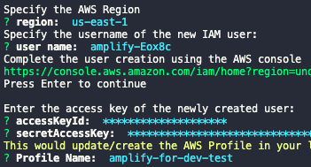
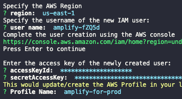
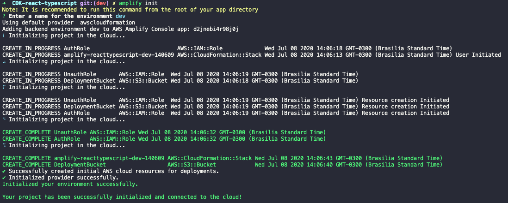
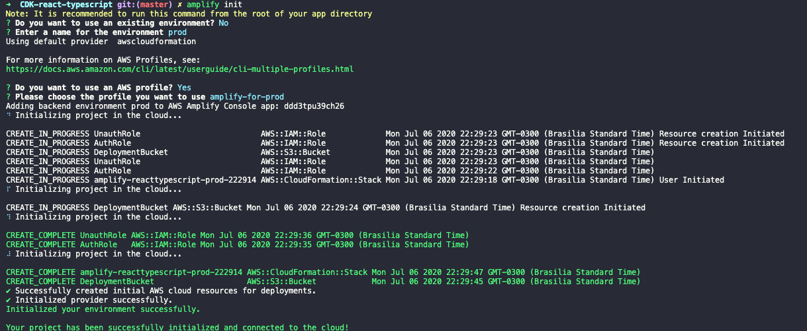
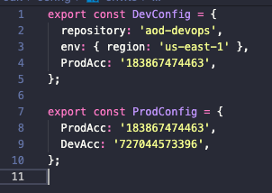
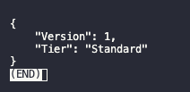
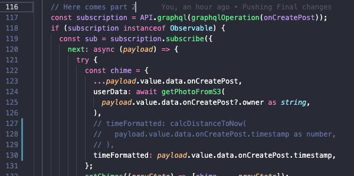
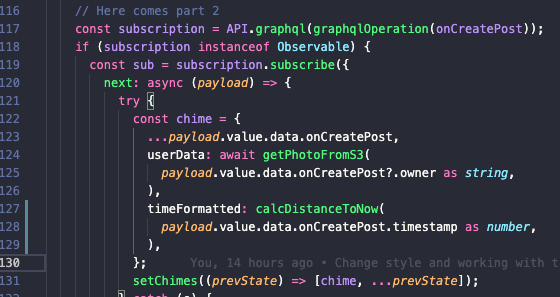

# Amplify Cross-Account with CodeCommit using CDK

This project was generated with:
 - [React](https://github.com/facebook/react) version 16.13.1.
 - [Amplify CLI](https://github.com/aws-amplify/amplify-cli) version 4.21.3.
 - [CDK](https://github.com/aws/aws-cdk) version 1.47.1.

The frontend is using React with amplify react UI for Authentication.
- It has unit test, integration test and UI test.

The backend is using Amplify with the following services:
- S3 as Storage.
- Cognito for authentication.
- S3 for hosting React Application.
- AppSync/GraphQL.

The CI/CD process is created through CDK using:
- CodeCommit, CodeBuild, CodePipeline, S3 and CloudFront.

## Story Case

A customer using Amplify needs across-account CI/CD between two AWS Accounts due to their company requirements and compliance. This customer have Developer AWS Account and Production AWS Account.

Until the moment, Amplify does not support natively cross-account using AWS CodeCommit as repo, as we can see [here](https://github.com/aws-amplify/amplify-console/issues/64) and [here](https://forums.aws.amazon.com/thread.jspa?messageID=928291).

### Solution

Create a custom CI/CD through Codepipeline using CDK, CodeBuild assumes production AWS Account and build amplify through STS::AssumeRole

It uses two **different** accounts simulating two AWS accounts: developer and production.
- Developer AWS Account is related to dev/test branches.
- Production AWS Account is related to master branch.

## Requirements
1. Install all the necessary tools:
   - Install [Node.JS](https://nodejs.org/en/download/).
   - Install [NPM](https://www.npmjs.com/get-npm).
   - Install [Amplify CLI](https://docs.amplify.aws/cli/start/install).
   - Install [AWS CLI V2](https://docs.aws.amazon.com/pt_br/cli/latest/userguide/cli-chap-install.html).
   - Install [AWS CDK](https://github.com/aws/aws-cdk)

2. Download this project.
3. Create a repository in CodeCommit.
4. Push this project into CodeCommit.


## Setup AWS Profile
>Create **two** IAM Users:
>>One simulating Developer/Test AWS Account.
>>
>>Another simulating Production AWS Account.

**Simulating Developer/Test AWS Account**
1. In your terminal, run `amplify configure`.
2. Sign in to your **dev/test** AWS account, go to terminal and `Press Enter` and follow the commands:
   1. Specify the AWS region.
   2. Specify the username of IAM user.
3. Click in the link and register a new IAM user.
4. Create a user with **AdministratorAccess** to your account to provision AWS resources like AppSync, Cognito etc.
5. Save your credentials in a safe place.
6. Once the user is created, Amplify CLI requests you to provide the **accessKeyId** and the **secretAccessKey** to connect Amplify CLI with your newly created IAM user.
7. Specify AWS Profile name to **amplify-for-dev-test**.



1. Sign out from AWS Console.

If you need more information, follow the [Amplify Documentation](https://docs.amplify.aws/start/getting-started/installation/q/integration/react#option-2-follow-the-instructions).

---

**Simulating Production AWS Account**
1. In your terminal, run `amplify configure`.
2. Sign in to your **prod** AWS account, go to terminal and `Press Enter` and follow the commands:
   1. Specify the AWS region.
   2. Specify the username of IAM user.
3. Click in the link and register a new IAM user.
4. Create a user with **AdministratorAccess** to your account to provision AWS resources like AppSync, Cognito etc.
5. Save your credentials in a safe place.
6. Once the user is created, Amplify CLI requests you to provide the **accessKeyId** and the **secretAccessKey** to connect Amplify CLI with your newly created IAM user.
7. Specify AWS Profile name to **amplify-for-prod**.



1. Sign out from AWS Console.

If you need more information, follow the [Amplify Documentation](https://docs.amplify.aws/start/getting-started/installation/q/integration/react#option-2-follow-the-instructions).

## Creating Amplify Environment

Create amplify environment: **dev**

1. Run `npm install` to install all the packages needed.
2. Run `npm run push:dev`, it will execute a script for pushing all the amplify services using **amplify-for-dev-test** AWS Profile with **dev** environment.

Under the hood, the script will execute the following steps:
   - Run `amplify init` and follow the instructions according to your environment.
   - Choose **dev** for dev environment.
   - Amplify requests for an AWS Profile. (Answer Y, choose the dev/test AWS profile - **amplify-for-dev-test**).
   
   - Run `amplify push` to push all the services to the cloud.

Create amplify environment: **prod**

1. Run `npm install` to install all the packages needed.
2. Run `npm run push:dev`, it will execute a script for pushing all the amplify services using **amplify-for-prod** AWS Profile with **prod** environment.

Under the hood, the script will execute the following steps:
   - Run `amplify init` and follow the instructions according to your environment.
   - Choose **prod** for production environment.
   - Amplify requests for an AWS Profile. (Answer Y, choose the prod AWS profile - **amplify-for-prod**).
       
   - Run `amplify push` to push all the services to the cloud.

When done, verify if exists a file in **/amplify/team-provider.info.json**.

1. Commit this file create a dev branch.
   ```
   git add .
   git commit -am 'Pushing all amplify configurations files.'
   git push --set-upstream origin master
   git checkout -b dev
   git push --set-upstream origin dev
   ```

2. This file should be in **both** branches in order to have a CI/CD with success.

## Running in your local development

1. Run `git checkout dev` to access your dev branch.
2. Run `amplify env checkout dev` to use amplify services for dev environment.
3. Run `npm run start` and open http://localhost:3000.

## Setting parameters for CDK & CodeBuild

**Edit env variables from CDK**

1. Rename `cdk/config/env.ts.example` to `cdk/config/env.ts`
2. Change the variables for your environment variables.
- To get the Account Number leveraging AWS CLI.
  ```
  aws sts get-caller-identity --profile amplify-for-dev-test
  aws sts get-caller-identity --profile amplify-for-prod
  ```


1. Configure your Access-Key and Secret-Key for dev/test environment.
   ```
   aws ssm put-parameter --name "access-key-amplify-dev-test" --type "SecureString" --value <YourAccessKey> --profile amplify-for-dev-test
   aws ssm put-parameter --name "secret-key-amplify-dev-test" --type "SecureString" --value <YourSecretKey> --profile amplify-for-dev-test
   ```
   1. If success, the image below should appear in your terminal.

   

## Deploying with CDK

1. Run `npm install` inside cdk folder.

The account you want to deploy have to be bootstrapped first, which means some minimal infrastructure is provisioned into the account so that the CDK can access it.
2. If first time using CDK, run `cd cdk && cdk bootstrap`


For CI/CD for development/test environment in cdk folder:
  1. Run `cdk deploy CICDDevStack --profile amplify-for-dev-test`

When the CDK deploy finishes, the pipeline will trigger and in a few minutes, you can check the endpoint created by cloudfront.

For CI/CD Production environment cdk folder:
  2. Run `cdk deploy ProdAccStack --profile amplify-for-prod`
  3. Run `cdk deploy CICDProdStack --profile amplify-for-dev-test`

When the CDK deploy finish, the pipeline will trigger, although, for production deployment, it is necessary to accept the manual approval in CodePipeline in order to continue.

## Testing CI/CD

A user tweeted and verified the distance from now is not working correctly. Please, find the error and fix that.

Access your dev environment.
1. Run `git checkout dev` and `amplify env checkout dev`.
2. Try to figure it out the bug.
  3. Go to pages/dashboard/index.tsx and uncomment 3 lines and erase the line 130.
  
  

3. Run `npm run start` and verify the changed made fixed the problem.
4. If everything went well - commit & push.
5. The pipeline from dev environment will trigger. When finished, access the cloudfront DNS and see the change.
6. Change branch to master and merge it.
```
git checkout master
git merge dev
git push
```
7. The pipeline from production environment will trigger.
8. Manual approve should be approved and when finished, access the cloudfront DNS to see the change.

### Testing your resources in local development
1. Run `npm run test` for Unit Test and Integration Test.
2. Run `node_modules/.bin/cypress run` for E2E Test.

### Clean your resources
>The S3 buckets should be deleted manually.

1. Run `cdk destroy ProdAccStack --profile amplify-for-prod`
2. Run `cdk destroy CICDDevStack --profile amplify-for-dev-test`
3. Run `cdk destroy CICDProdStack --profile amplify-for-dev-test`

### Issues

1. Removed E2E tests with cypress in codebuild due to lack of perfomance and instability.
  1. You still can run `node_modules/.bin/cypress run` in your local.
