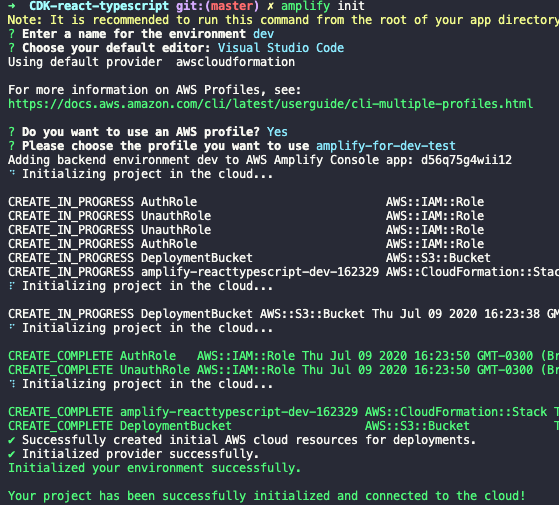

# Amplify Cross Account CI/CD Using CDK

This project was generated with:
 - [React](https://github.com/facebook/react) version 16.13.1.
 - [Amplify CLI](https://github.com/aws-amplify/amplify-cli) version 4.21.3.
 - [CDK](https://github.com/aws/aws-cdk) version 1.47.1.

The frontend is using React with amplify react UI for Authentication.
- It has unit test, integration test and UI test.

The backend is using Amplify with the following services:
- S3 as Storage.
- Cognito for authentication.
- S3 for hosting React Application.
- AppSync/GraphQL.

The CI/CD process is created through CDK using:
- Github as Source, Codebuild, Codepipeline, S3 and CloudFront.

# Story Case

A customer using Amplify requests cross-account CI/CD since their company have Developer AWS Account and Production AWS Account.

Until the moment, Amplify does not support natively cross-account as we can see [here](https://github.com/aws-amplify/amplify-console/issues/64) and [here](https://forums.aws.amazon.com/thread.jspa?messageID=928291).

## Solution

Create a custom CI/CD through Codepipeline using CDK.

It`s using two **different** account simulating two AWS accounts: developer and production.
- Developer AWS Account is related to dev/test branches.
- Production AWS Account is related to master branch.


## Requirements
1. Install all the necessary tools:
   - Install [Node.JS](https://nodejs.org/en/download/).
   - Install [NPM](https://www.npmjs.com/get-npm).
   - Install [Amplify CLI](https://docs.amplify.aws/cli/start/install).
   - Install [AWS CLI V2](https://docs.aws.amazon.com/pt_br/cli/latest/userguide/cli-chap-install.html).
   - Install [AWS CDK](https://github.com/aws/aws-cdk)

2. Fork this project for testing CI/CD.
3. Clone the forked repository to your local.

## Setup AWS Profile
>Create **two** IAM Users:
>>One simulating Developer/Test AWS Account.
>>
>>Another simulating Production AWS Account.

**Simulating Developer/Test AWS Account**
1. In your terminal, run `amplify configure`.
2. Sign in to your **dev/test** AWS account, go to terminal and `Press Enter` and follow the commands:
   1. Specify the AWS region.
   2. Specify the username of IAM user.
3. Click in the link and register a new IAM user.
4. Create a user with **AdministratorAccess** to your account to provision AWS resources like AppSync, Cognito etc.
5. Once the user is created, Amplify CLI requests you to provide the **accessKeyId** and the **secretAccessKey** to connect Amplify CLI with your newly created IAM user.
6. Specify AWS Profile name to **amplify-for-dev-test**.


7. Save this access/secret key in a safe place.
7. Sign out from AWS Console.

---

**Simulating Production AWS Account**
1. In your terminal, run `amplify configure`.
2. Sign in to your **prod** AWS account, go to terminal and `Press Enter` and follow the commands:
   1. Specify the AWS region.
   2. Specify the username of IAM user.
3. Click in the link and register a new IAM user.
4. Create a user with **AdministratorAccess** to your account to provision AWS resources like AppSync, Cognito etc.
5. Once the user is created, Amplify CLI requests you to provide the **accessKeyId** and the **secretAccessKey** to connect Amplify CLI with your newly created IAM user.
6. Specify AWS Profile name to **amplify-for-prod**.

7. Save this access/secret key in a safe place.
7. Sign out from AWS Console.

If you need more information, follow the [Amplify Documentation](https://docs.amplify.aws/start/getting-started/installation/q/integration/react#option-2-follow-the-instructions).


## Creating Amplify Environment

Create amplify environment: **dev**
1. Run `npm install` to install all the packages needed.
2. Run `amplify init` and follow the instructions according to your environment.
3. Choose **dev** for dev environment.
4. Amplify requests for an AWS Profile. (Answer Y, choose the dev/test AWS profile - **amplify-for-dev-test**).


Create amplify environment: **prod**
1. Run `amplify init` and follow the instructions according to your environment.
2. Choose **prod** for production environment.
3. Amplify requests for an AWS Profile. (Answer Y, choose the prod AWS profile - **amplify-for-prod**).
    

When done, verify if exists a file in **/amplify/team-provider.info.json**.

1. Commit this file and merge master branch into dev.
   1. Run `git add .`
   3. Run `git checkout -b dev`
   4. Run `git commit -am 'Pushing all amplify configurations files.'`
2. This file should be in **both** branches in order to run CI/CD with success.

## Running in your local development

1. Run `amplify env checkout dev`
2. Run `amplify push` and create all the resources.
3. Run `npm run start` and open http://localhost:3000

## Deploy CI/CD Process Using CDK

**Edit env variables from CDK**

1. Rename cdk/config/env.ts.example to cdk/config/env.ts
2. Change the variables for your environment variables.


1. Run the command below using your github Token
   1. To get your gitHubToken, follow the instructions [here](https://docs.aws.amazon.com/codepipeline/latest/userguide/GitHub-authentication.html)
   ```
    aws secretsmanager create-secret \
    --name GitHubToken \
    --secret-string <YourGitHubTokenID> \
    --region us-east-1 --profile amplify-for-dev-test
    ```
2. Configure your Access-Key and Secret-Key for dev/test environment.
   ```
   aws ssm put-parameter --name "access-key-amplify-dev-test" --type "SecureString" --value <YourAccessKey> --profile amplify-for-dev-test
   aws ssm put-parameter --name "secret-key-amplify-dev-test" --type "SecureString" --value <YourSecretKey> --profile amplify-for-dev-test
   ```
   3. If success, the image below should appear in your terminal.

   

3. If, first time using CDK, Run `cd cdk && cdk bootstrap`
4. Run `npm install` inside cdk folder.
4. For CI/CD for development/test environment:
  1. Run `cdk deploy CICDDevStack --profile amplify-for-dev-test`
5. For CI/CD Production environment:
  2. Run `cdk deploy ProdAccStack --profile amplify-for-prod`
  3. Run `cdk deploy CICDProdStack --profile amplify-for-dev-test`

### Testing CI/CD

A user tweeted and verified the distance from now is not working correctly. Please, find the error and fix that.

Access your dev environment.
1. Run `git checkout dev` and `amplify env checkout dev`
2. Try to figure it out the bug.
  3. Go to pages/dashboard/index.tsx and uncomment 3 lines and erase the line 130.
  
  

3. Run `npm run start` and verify the changed made fixed the problem and commit & push.
4. If everything went well, merge dev into master.

### Testing your resources in local development

1. Run `npm run test` for Unit Test and Integration Test.
2. Run `node_modules/.bin/cypress run` for E2E Test.

### Clean your resources
>The S3 buckets should be deleted manually.

1. Run `cdk destroy ProdAccStack --profile amplify-for-prod`
2. Run `cdk destroy CICDDevStack --profile amplify-for-dev-test`
3. Run `cdk destroy CICDProdStack --profile amplify-for-dev-test`

### Issues

1. Removed E2E tests with cypress in codebuild due to lack of perfomance and instability, sometimes work and sometimes doesn`t.
  1. You still can run `node_modules/.bin/cypress run` in your local.

